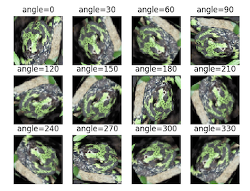

# Q. データセット用意

## Q.1. 自分で用意した学習データセット読み込み 

まずはディープラーニングを学習させるためのデータセットの準備をします。

フレームワークに関係なく、学習データセットの入力画像は４次元配列で準備することが殆どです。

ここでいう４次元は[データ数、画像の縦サイズ、画像の横サイズ、チャネル(RGBの3かグレースケールの1)]となります。
ただしこの順番はフレームワークによって変わります。


| フレームワーク | データの順番 |
|:---:|:---:|
| Tensorflow, Keras(Tensorflow)| [データ数、画像の縦サイズ、画像の横サイズ、チャネル] |
| PyTorch, Chainer, Caffe  | [データ数、チャネル、画像の縦サイズ、画像の横サイズ] |

つまり、変数*xs*に学習データセットが代入された場合、xs[0]とすると、1枚めの画像(Height x Width x Channelの画像データ)を取得できるようになります。

一方、教師ラベルのデータは、１次元もしくは二次元配列で用意します。
1次元の場合はクラスのインデックス(例えば３クラス分類にて犬なら0、イモリなら1、ヤモリなら2みたいな)を指定するが、二次元の場合はone-hot表現を用いる(犬なら[1,0,0]、イモリなら[0,1,0]、ヤモリなら[0,0,1]みたいな)。
これもフレームワークによって変わります。


| フレームワーク | 教師ラベルのデータ |
|:---:|:---:|
| PyTorch, Chainer | index [データ数] |
| Tensorflow, Keras(Tensorflow), Caffe  | one-hot [データ数、クラス数] |

**このようにフレームワークによって用意するデータの形が変わるので注意**

ここではdata_load()という関数を用意して、画像の学習データセット、教師データセットを用意して、それぞれxs, tsという変数に格納してxs, tsを返す仕様にしてください。対象とするフレームワークは**PyTorch**で*Dataset/train/images*のアカハライモリとマダライモリの２クラス分類を想定します。
用いるデータセットは*Dataset/train/images*の*akahaara*と*madara*を用いてください。
akaharaはクラス0、madaraはクラス1に属します。

プログラムの順番は、
1. xs, tsを用意。
2. ディレクトリの画像xを読み込み、固定サイズにリサイズする。値を255で割って[0,1]の範囲に正規化する。
3. xsにxを追加する。 xs = np.vstack((xs, x))
4. 教師ラベルtを何らかの方法で取得する。
5. tsにtを追加する。 ts = np.vstack((ts, t))
6. pathsに画像のパスを追加appendする
7. 2-6をディレクトリの画像全部に対して行う。

以下のコードを埋めて完成させてみてください。自分で一から作っても全然構いません。

```python
import cv2
import numpy as np
from glob import glob

num_classes = 2
img_height, img_width = 64, 64

CLS = ['akahara', 'madara']

def data_load(path):
    xs = []
    ts = []
    paths = []

    # answer your code
    ...
    #
    return xs, ts, paths

xs, ts, paths = data_load('../Dataset/train/images/')
```

答え >> [answers/answer_data_load.py](answers/answer_data_load.py)

## Q.2. ミニバッチ作成

学習データが完成したら、次はミニバッチを作成しなければいけません。

学習データ全部を**バッチ**という表現をしていて、**ミニバッチ**とはバッチの一部分、つまりバッチからいくつか選んだデータの集合を指します。ディープラーニングではたくさんメモリを使うので、全部のデータを一度に用いることができません。そこでバッチを分割してミニバッチにして学習させます。

ここではxs, tsからミニバッチを作成するプログラムを作成してみましょう。

作り方はいくつかあるがここではデータセットと同じ数のインデックスの配列を用意し、それをシャッフルしながらミニバッチを作成します。今回の学習データは16枚なので、np.arange(len(xs))で[0, 1, 2, 3, ..., 15]というインデックスの配列train_indを用意します。それをシャッフルします。ここから3つ分選んでxs[index], ts[index]とすればミニバッチを選ぶことができます。

これで選んでいくと、最後は２つしか残らなくなってしまうが、そのときはインデックス配列をシャッフルして、そこから一つ追加してミニバッチにします。

mbiに一個前に選んだインデックス配列の最後の位置を格納しましう。
ここではミニバッチ数mb=3を10回繰り返して選んだミニバッチのインデックスmb_indを表示してください。

```python
mb = 3
mbi = 0
train_ind = np.arange(len(xs))
np.random.seed(0)
np.random.shuffle(train_ind)

for i in range(100):
    # answer your code
    ...
    #
    print(mb_ind)
```


答え

```bash
$ python answer_minibatch.py
[1 6 8]
[ 9 13  4]
[ 2 14 10]
[ 7 15 11]
[3 0 5]
[6 8 5]
[ 6  9 14]
[ 9 11  4]
[13 11  0]
[11  0  9]
```

答え >> [answers/answer_minibatch.py](answers/answer_minibatch.py)


## Q.3. イテレーションとエポック

ディープラーニングの学習はミニバッチを何回使うかの学習回数が重要となります。
これはイテレーションiterationとかstepだとかepochとかって呼ばれます。

iteration,stepは何回ミニバッチを回すか、epochはバッチを何回回すかを指すことが多いです。

Q.2-2では10回ミニバッチを回したが、これは10iterationしたことになります。
ここでは3エポックを実装してみましょう。


ここまでできれば、あとはディープラーニングを学習させるだけ！！

答え

```bash
[1 6 8]
[ 9 13  4]
[ 2 14 10]
[ 7 15 11]
[3 0 5]
[6 8 5]
[3 7 1]
[ 9 13 15]
[11  4 12]
[10  0 14]
[8 6 9]
[14 15  1]
[12  2 13]
[10  4  0]
[ 5 11  7]
[3 8 6]
[11  4 14]
```

答え >> [answers/answer_epoch.py](answers/answer_epoch.py)


## Q.4. データ拡張・左右反転

ディープラーニングは学習データがめちゃくちゃ多くないといけません。小さいモデルなら少ないデータでも大丈夫だけど、大きいモデルの方が最終的には精度は高いです。しかし大きいモデルは大量のデータがないと学習が進まないというジレンマがあります。これを解決するために学習データを水増しする手法はよく取られます。

ここではデータ拡張の一つとして左右を反転させます。
これはデータを読み込んだ後に、画像の左右を反転させたものも一つの学習データとして加えるものです。

*data_load()*の引数に*hf* という引数(デフォルはFalse)を加えて左右反転も加えられるようにして下さい。

答え >> [answers/answer_hf.py](answers/answer_hf.py)

## Q.5. データ拡張・上下反転

ここではデータ拡張として上下を反転させたものを加えてみましょう。

*data_load()*の引数に*vf* という引数(デフォルはFalse)を加えて左右反転も加えられるようにして下さい。

答え >> [answers/answer_vf.py](answers/answer_vf.py)

## Q.6. データ拡張・回転

ここでは画像を回転させたものも学習データに加えていきます。30度ずつ回転させたものも学習データに加えてみましょう。

*data_load()* の引数に *rot* という引数(デフォルはFalseを加えて左右反転も加えられるようにして下さい。rotがFalseのときは回転は加えない、数値のときは数値毎に回転させた画像もデータセットに加えるようにしてみましょう。



答え >> [answers/answer_rotation.py](answers/answer_rotation.py)


# オープンソースのデータセットを使う

## Q.1-1 MNIST Step.1 ダウンロード

MNISTはNISTが公開している手書きの文字（0から9）の10クラス分類を行うための有名なオープンデータセットの1つです。学習データ60,000枚、テストデータ10,000枚で構成されます。
ここではMNISTを読み込むためのプログラムを作成してみましょう。(以下は https://deepage.net/features/numpy-neuralnetwork-5.html を参照)

MNIStの公式ページはここです。>>  http://yann.lecun.com/exdb/mnist/
これの「train-images-idx3-ubyte.gz, train-labels-idx1-ubyte.gz, t10k-images-idx3-ubyte.gz, t10k-labels-idx1-ubyte.gz」が今回使うデータセットのgzファイルですが、まずはカレントディレクトリにこれらのファイルがなければ、ダウンロードするコードを書いてみましょう。
ここではlinuxかosxを想定して、「wget」でダウンロードします。

答え >> [answers/load_mnist_step1.py](answers/load_mnist_step1.py)

## Q.1-2 MNIST Step.2 学習データの読み込み

MNISTのデータはバイナリ化されていて、非常に扱いにくいです。これを最終的には、[データ数, 28, 28]のshapeを持ったnumpyに変換したいです。そこで、gzip.open()とnumpy.frombuffer()という関数を使って、上記のデータを読み込みます。

```python
with gzip.open("train-images-idx3-ubyte.gz", 'rb') as f:
    train_x = np.frombuffer(f.read(), np.uint8, offset=16)
```
こうすると、train_xには[47040000 (=60,000x28x28)]のnumpyが入ります。これを[60,000, 28, 28, 1]のshapeに変更しましょう。そして、型もfloatに変更しましょう。


ラベルに関しては、以下で同様に読み込めます。

```python
with gzip.open("train-labels-idx1-ubyte.gz", 'rb') as f:
    train_y = np.frombuffer(f.read(), np.uint8, offset=8)
```

答え >> [answers/load_mnist_step2.py](answers/load_mnist_step2.py)

## Q.1-3 MNIST Step. Final テストデータの読み込み

test_batchに関しても同じように test_xとtest_yに分けて見ましょう。
最後に関数の返り値をtrain_x, train_y, test_x, test_yとしてkeras.datasets.load_mnistっぽくしてみましょう。

答え >> [answers/load_mnist.py](answers/load_mnist.py)

## Q.2-1 CIFAR-10 Step.1 ダウンロード

CIFAR-10は10クラス分類を行うための有名なオープンデータセットの1つです。学習データ50,000枚、テストデータ10,000枚で構成されます。
ここではCIFAR-10を読み込むためのプログラムを作成してみましょう。

CIFAR-10の公式ページはここです。>>  https://www.cs.toronto.edu/~kriz/cifar.html
これの「CIFAR-10 python version」が今回使うデータセットのtarファイルですが、まずはカレントディレクトリに「cifar-10-batches-py」がなければ、ダウンロードするコードを書いてみましょう。
ここではlinuxかosxを想定して、「wget」でダウンロード、「tar」でダウンロードしたファイルを展開します。

wgetするURLは https://www.cs.toronto.edu/~kriz/cifar-10-python.tar.gz

答え >> [answers/load_cifar10_step1.py](answers/load_cifar10_step1.py)

## Q.2-2 CIFAR-10 Step.2 学習データの読み込み

Step.1で展開したファイルは下記の構造となります。

```bash
cifar-10-batches-py --- readme.html
                     |- data_batch_1 (~5)
                     |- test_batch
                     |- batches.meta
```

data_batch_1 - 5 には学習データ、test_batch　にはテストデータが入っています。
公式サイトによれば、

```python
with open('data_batch_1', 'rb') as f:
    datas = pickle.load(f, encoding='bytes')
    x = datas[b'data']
    y = np.array(datas[b'labels'], dtype=np.int)
```
でxに入力画像のデータ、yに教師ラベルが入ります。ただし、xは[10000, 3072( = 3 x 32 x 32)] という形になっているので、これを元の画像の大きさ、[10000, 32, 32, 3]にする必要があります。

ここでは、data_batch_の1 - 5の全てを、train_xに入力画像のデータ、train_yに教師ラベルのデータとしてまとめてみましょう。

答え >> [answers/load_cifar10_step2.py](answers/load_cifar10_step2.py)

## Q.2-3 CIFAR-10 Step.Final テストデータの読み込み

test_batchに関しても同じように test_xとtest_yに分けて見ましょう。
最後に関数の返り値をtrain_x, train_y, test_x, test_yとしてkeras.datasets.load_mnistっぽくしてみましょう。

答え >> [answers/load_cifar10.py](answers/load_cifar10.py)

## Q. Fashion MNIST

Fashion MNISTは10種類の衣服に関する画像認識のためのデータセット

公式サイトは https://github.com/zalandoresearch/fashion-mnist

ファイル形式はMNISTと同じらしい。

各ラベルは、

0.    T-shirt/top
1.    Trouser
2.    Pullover
3.    Dress
4.    Coat
5.    Sandal
6.    Shirt
7.    Sneaker
8.    Bag
9.    Ankle boot

となっている

答え >> [answers/load_fashion_mnist.py](answers/load_fashion_mnist.py)
