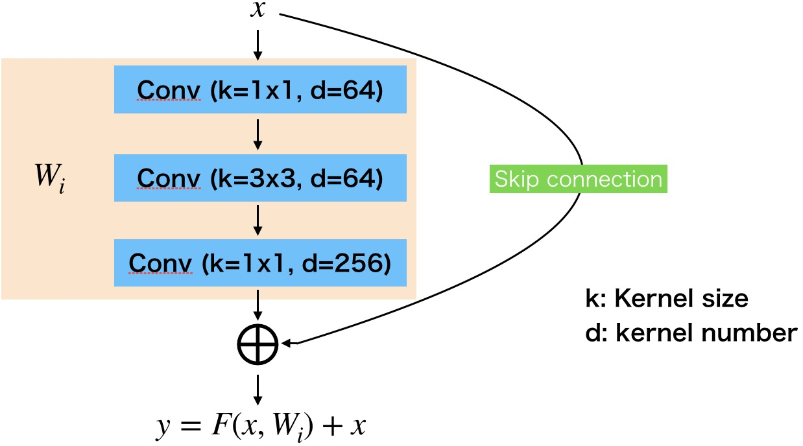
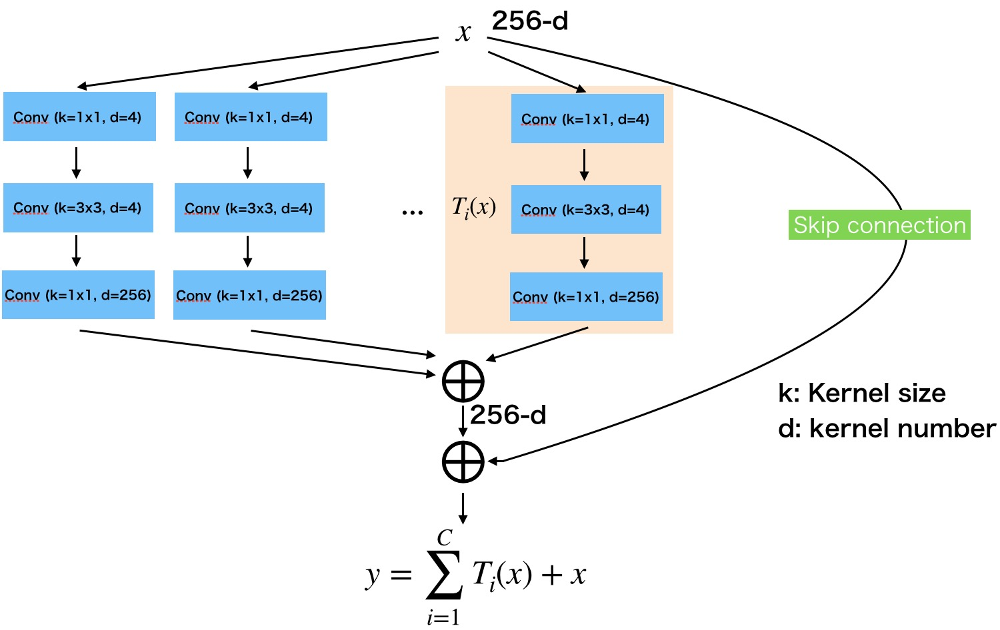
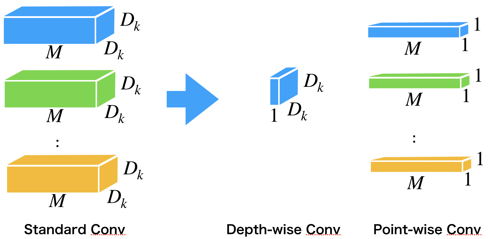
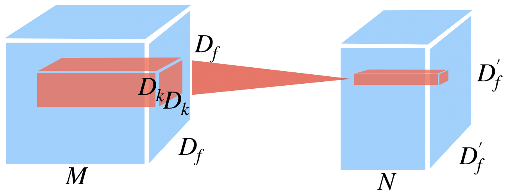
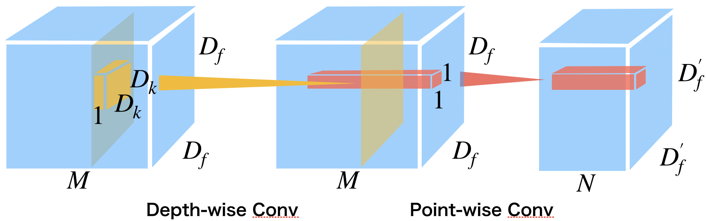
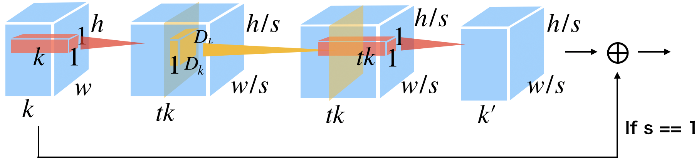

# Q. 画像認識編

ここではCNNの有名モデルを自分の手で実装していきます。フレームワークは自由だが、**とりあえずPyTorch, Tensorflow, Keras, Chainer全部で実装してください。**
ネットワークを作ったら、学習率やイテレーションを変えて、テストデータセット *../Dataset/test/images* でテストしてみてください。

## API

各有名モデルのAPIを使ってみましょう。

pytorchは 

```bash
$ pip install cnn_finetune
```
をして、ライブラリを追加しなきゃいけません。

| FW | function | | FW | function |
|:---:|:---:|:---:|:---:|:---:|
| pytorch | cnn_finetune.make_model  | | Keras |  |
| TensorFlow |  | | Chainer |  |

pytorchの参考サイト >> https://github.com/creafz/pytorch-cnn-finetune

答え
- Pytorch [answers/api_pytorch.py](answers/api_pytorch.py)
- Tensorflow [answers/lenet_tensorflow_layers.py](answers/lenet_tensorflow_layers.py)
- Keras [answers/lenet_keras.py](answers/lenet_keras.py)
- chainer [answers/lenet_chainer.py](answers/lenet_chainer.py)

## Q. LeNet

元論文 >> http://yann.lecun.com/exdb/publis/pdf/lecun-01a.pdf

これが原初のモデル。MNISTと呼ばれる0から9までの手書き数字の判別で使われたCNNモデル。これを実装してください。LeNetはMNIST用に入力サイズが32x32となっているが、ここで用意しているデータセットは128x128サイズです。**よって学習時のデータの入力サイズを32x32にリサイズする必要があります。**

構造はこうです。

| Layer | カーネルサイズ | フィルタ数 |  ストライド| パディング |  活性化関数 | 
|:---:|:---:|:---:|:---:|:---:|:---:|
| Input | 32 x 32 x 3(入力サイズ) |
| Convolution | 5 x 5 |  6 | 1 | 0 | - |
| MaxPooling | 2 x 2 | - | 2 | 0 | sigmoid |
| Convolution | 5 x 5 | 16 | 1 | 0 | - |
| MaxPooling | 2 x 2 | - | 2 | 0 | sigmoid |
| MultiLayerPerceptron | 120 | - | - | - | - | - |
| MultiLayerPerceptron |  64 | - | - | - | - | - |
| MultiLayerPerceptron | 2 (クラス) | - | - | - | - | Softmax|


答え
- Pytorch [answers/lenet_pytorch.py](answers/lenet_pytorch.py)
- Tensorflow [answers/lenet_tensorflow_layers.py](answers/lenet_tensorflow_layers.py)
- Keras [answers/lenet_keras.py](answers/lenet_keras.py)
- chainer [answers/lenet_chainer.py](answers/lenet_chainer.py)

## Q. AlexNet

元論文 >> https://papers.nips.cc/paper/4824-imagenet-classification-with-deep-convolutional-neural-networks

ディープラーニングを流行らせた張本人モデル。ImageNetという画像認識のコンペILSVRC2012で圧倒的一位で優勝したことから現在のディープラーニングブームが起こりました。これを実装してくさい。
AlexNetでは*Local Response Normalization* という特別な正規化Layerがあります。

| FW | function | | FW | function |
|:---:|:---:|:---:|:---:|:---:|
| PyTorch | torch.nn.modules.normalization.LocalResponseNorm() | | Keras | - |
| TensorFlow | tf.nn.local_response_normalization() | | Chainer | chainer.functions.local_response_normalization() |

LRNは効果が薄いことから最近ではほとんど使われてません。こういうのもあったんだなあ程度に覚えておくといいと思います。

ただし学習データの枚数が少ないので学習が進まないので、精度を上げたいときは自分で学習データを増やすか、パラメータ数を変えるなどの工夫が必要なので注意。

| Layer | カーネルサイズ | フィルタ数 | ストライド| パディング | 活性化関数 | 
|:---:|:---:|:---:|:---:|:---:|:---:|
| Input | 227 x 227 x 3 (入力サイズ) |
| Convolution | 11 x 11 | 96 | 4 | 0 | ReLU |
| LocalResponseNormalization | - | - | - | - | - |
| MaxPooling | 3 x 3 | 2 | 0 | - | - |
| Convolution | 5 x 5 | 256 | 1 | 1 | ReLU |
| LocalResponseNormalization | - | - | - | - | - |
| MaxPooling | 3 x 3 | 2 | 0 | - | - |
| Convolution | 3 x 3 | 384 | 1 | 1 | ReLU |
| Convolution | 3 x 3 | 384 | 1 | 1 | ReLU |
| Convolution | 3 x 3 | 256 | 1 | 1 | ReLU |
| MaxPooling | 3 x 3 | 2 | 0 | - | - |
| MultiLayerPerceptron | 4096 | - | - | - | - | ReLU + Dropout |
| MultiLayerPerceptron | 4096 | - | - | - | - | ReLU + Dropout |
| MultiLayerPerceptron | 2 (クラス) | - | - | - | - | Softmax|


答え
- Pytorch [answers/alexnet_pytorch.py](answers/alexnet_pytorch.py)
- Tensorflow [answers/alexnet_tensorflow_layers.py](answers/alexnet_tensorflow_layers.py)
- Keras [answers/alexnet_keras.py](answers/alexnet_keras.py)
- chainer [answers/alexnet_chainer.py](answers/alexnet_chainer.py)


## Q. ZFNet

元論文 >> https://arxiv.org/abs/1311.2901

ILSVRC2013で一位をとったモデル。AlexNetと構造が似てます。
Alexnetの最初のconvlutionを7x7のカーネルにして、ストライドを2に変更してます。そのかわりに２つ目のconvolutionのストライドを2にしてます。こうすることで、大きなカーネルサイズによる画像の周波数取得を変えてます。論文ではCNNが画像認識を行うまでの解析を主張してｍす。

ここらへんから計算時間がめちゃくちゃ増えるので、GPU使用をおすすめ。もしくは入力サイズを112x112とか小さくすることを推奨。

| Layer | カーネルサイズ | フィルタ数 | ストライド| パディング | 活性化関数 | 
|:---:|:---:|:---:|:---:|:---:|:---:|
| Input | 224 x 224 x 3 (入力サイズ) |
| Convolution | 7 x 7 | 96 | 2 | 0 | ReLU |
| LocalResponseNormalization | - | - | - | - | - |
| MaxPooling | 3 x 3 | 2 | 0 | - | - |
| Convolution | 5 x 5 | 256 | 2 | 1 | ReLU |
| LocalResponseNormalization | - | - | - | - | - |
| MaxPooling | 3 x 3 | 2 | 0 | - | - |
| Convolution | 3 x 3 | 384 | 1 | 1 | ReLU |
| Convolution | 3 x 3 | 384 | 1 | 1 | ReLU |
| Convolution | 3 x 3 | 256 | 1 | 1 | ReLU |
| MaxPooling | 3 x 3 | 2 | 0 | - | - |
| MultiLayerPerceptron | 4096 | - | - | - | - | ReLU + Dropout |
| MultiLayerPerceptron | 4096 | - | - | - | - | ReLU + Dropout |
| MultiLayerPerceptron | 2 (クラス) | - | - | - | - | Softmax|

答え
- Pytorch [answers/zfnet_pytorch.py](answers/zfnet_pytorch.py)
- Tensorflow [answers/zfnet_tensorflow_layers.py](answers/zfnet_tensorflow_layers.py)
- Keras [answers/zfnet_keras.py](answers/zfnet_keras.py)
- chainer [answers/zfnet_chainer.py](answers/zfnet_chainer.py)

## Q. Global Average Pooling

ここではGlobal average poolingを実装してください。これはMLPを使わないでConvolutionaだけのモデル(**FCN: Fully Convolutional Network**)でクラス分類を行うために考案されました。通常クラス分類はMLPをクラスの数だけ用意する必要があるけど、これではネットワークへの入力サイズが固定化されてしまいます。これはMLPの性質による。しかしGAPによりこれは解決されます。

GAPはConvolutionによる生成される特徴マップの内の１チャネルの全部の値のaverage値を取る操作を行います。そうすると、チャネルの数だけの値が取れます。これにSoftmax関数を適用することでクラス分類が行われます。

アルゴリズムは、
1. ネットワークのMLPを消す。
2. クラス数の**カーネル数**(カーネルサイズでないので注意カーネルサイズはよく1x1が使われる。)を持ったConvolutionを最後につける。
3. GAPを適用する。
4. Softmaxを適用する。

これでFCNの完成です！人によってはGAP後にMLPを入れる時もあるが、どちらにしても入力画像サイズが自由なモデルが作れます。GAPはNetwork in networkの論文で提唱された手法です。

今回はZFネットにGAPを適用してください。

| FW | function | FW | function |
|:---:|:---:|:---:|:---:|
| PyTorch | torch.nn.AdaptiveAvgPooling2d() + Viewでreshape | Keras | keras.layers.GlobalAveragePooling2D() |
| TensorFlow | tf.reduce_mean()を２回適用 | Chainer | chainer.functions.average() |

答え
- Pytorch [answers/gap_pytorch.py](answers/gap_pytorch.py)
- Tensorflow [answers/gap_tensorflow_layers.py](answers/gap_tensorflow_layers.py)
- Keras [answers/gap_keras.py](answers/gap_keras.py)
- chainer [answers/gap_chainer.py](answers/gap_chainer.py)


## Q. Network in network

論文 >> https://arxiv.org/abs/1312.4400

Network in network(NIN)は1x1のconvoutionを導入したネットワークです。

| Layer | カーネルサイズ | フィルタ数 | ストライド| パディング | 活性化関数 | 
|:---:|:---:|:---:|:---:|:---:|:---:|
| Input | 128 x 128 x 3 (入力サイズ) |
| Convolution | 5 x 5 | 192 | 1 | 2 | ReLU |
| Convolution | 1 x 1 | 160 | 1 | 0 | ReLU |
| Convolution | 1 x 1 | 96 | 1 | 0 | ReLU |
| MaxPooling | 3 x 3 | 2 | 0 | - | - |
| Dropout |
Convolution | 5 x 5 | 192 | 1 | 2 | ReLU |
| Convolution | 1 x 1 | 192 | 1 | 0 | ReLU |
| Convolution | 1 x 1 | 192 | 1 | 0 | ReLU |
| MaxPooling | 3 x 3 | 2 | 0 | - | - |
| Dropout |
Convolution | 3 x 3 | 192 | 1 | 1 | ReLU |
| Convolution | 1 x 1 | 192 | 1 | 0 | ReLU |
| Convolution | 1 x 1 | 2(クラス数) | 1 | 0 | ReLU |
| GAP | | | | | Softmax |

答え
- Pytorch [answers/nin_pytorch.py](answers/nin_pytorch.py)
- Tensorflow [answers/nin_tensorflow_layers.py](answers/nin_tensorflow_layers.py)
- Keras [answers/nin_keras.py](answers/vgg16_keras.py)
- chainer [answers/nin_chainer.py](answers/nin_chainer.py)

## Q. VGG16

元論文 >> https://arxiv.org/abs/1409.1556

VGG16とはOxfort大学の研究グループが提案したモデルであり、けっこう色んな手法のベースに使われているモデルです。VGG16では3x3のカーネルを持ったConvoutionを重ねることでモデルが取得する特徴の非線形性を増大させてます。16というのはconvolutionとMLPを合わせて16という意味らしいっす。

| Layer | カーネルサイズ | フィルタ数 | ストライド| パディング | 活性化関数 | 
|:---:|:---:|:---:|:---:|:---:|:---:|
| Input | 224 x 224 x 3 (入力サイズ) |
| Convolution | 3 x 3 | 64 | 1 | 1 | ReLU |
| Convolution | 3 x 3 | 64 | 1 | 1 | ReLU |
| MaxPooling | 2 x 2 | 2 | 0 | - | - |
| Convolution | 3 x 3 | 128 | 1 | 1 | ReLU |
| Convolution | 3 x 3 | 128 | 1 | 1 | ReLU |
| MaxPooling | 2 x 2 | 2 | 0 | - | - |
| Convolution | 3 x 3 | 256 | 1 | 1 | ReLU |
| Convolution | 3 x 3 | 256 | 1 | 1 | ReLU |
| Convolution | 3 x 3 | 256 | 1 | 1 | ReLU |
| MaxPooling | 2 x 2 | 2 | 0 | - | - |
| Convolution | 3 x 3 | 512 | 1 | 1 | ReLU |
| Convolution | 3 x 3 | 512 | 1 | 1 | ReLU |
| Convolution | 3 x 3 | 512 | 1 | 1 | ReLU |
| MaxPooling | 2 x 2 | 2 | 0 | - | - |
| Convolution | 3 x 3 | 512 | 1 | 1 | ReLU |
| Convolution | 3 x 3 | 512 | 1 | 1 | ReLU |
| Convolution | 3 x 3 | 512 | 1 | 1 | ReLU |
| MaxPooling | 2 x 2 | 2 | 0 | - | - |
| MultiLayerPerceptron | 4096 | - | - | - | - | ReLU + Dropout |
| MultiLayerPerceptron | 4096 | - | - | - | - | ReLU + Dropout |
| MultiLayerPerceptron | 2 (クラス) | - | - | - | - | Softmax|

答え
- Pytorch [answers/vgg16_pytorch.py](answers/vgg16_pytorch.py)
- Tensorflow [answers/vgg16_tensorflow_layers.py](answers/vgg16_tensorflow_layers.py)
- Keras [answers/vgg16_keras.py](answers/vgg16_keras.py)
- chainer [answers/vgg16_chainer.py](answers/vgg16_chainer.py)

## Q. VGG19

VGG19はVGG16にConvolutionが3つ増えたバージョン。こっちよりもVGG16のほうがよく使われてます。多分認識精度とパラメータ数が割に合わないのかと。とりあえずモデル理解のために実装してみましょう。

| Layer | カーネルサイズ | フィルタ数 | ストライド| パディング | 活性化関数 | 
|:---:|:---:|:---:|:---:|:---:|:---:|
| Input | 224 x 224 x 3 (入力サイズ) |
| Convolution | 3 x 3 | 64 | 1 | 1 | ReLU |
| Convolution | 3 x 3 | 64 | 1 | 1 | ReLU |
| MaxPooling | 2 x 2 | 2 | 0 | - | - |
| Convolution | 3 x 3 | 128 | 1 | 1 | ReLU |
| Convolution | 3 x 3 | 128 | 1 | 1 | ReLU |
| MaxPooling | 2 x 2 | 2 | 0 | - | - |
| Convolution | 3 x 3 | 256 | 1 | 1 | ReLU |
| Convolution | 3 x 3 | 256 | 1 | 1 | ReLU |
| Convolution | 3 x 3 | 256 | 1 | 1 | ReLU |
| **Convolution** | 3 x 3 | 256 | 1 | 1 | ReLU |
| MaxPooling | 2 x 2 | 2 | 0 | - | - |
| Convolution | 3 x 3 | 512 | 1 | 1 | ReLU |
| Convolution | 3 x 3 | 512 | 1 | 1 | ReLU |
| Convolution | 3 x 3 | 512 | 1 | 1 | ReLU |
| **Convolution** | 3 x 3 | 512 | 1 | 1 | ReLU |
| MaxPooling | 2 x 2 | 2 | 0 | - | - |
| Convolution | 3 x 3 | 512 | 1 | 1 | ReLU |
| Convolution | 3 x 3 | 512 | 1 | 1 | ReLU |
| Convolution | 3 x 3 | 512 | 1 | 1 | ReLU |
| **Convolution** | 3 x 3 | 512 | 1 | 1 | ReLU |
| MaxPooling | 2 x 2 | 2 | 0 | - | - |
| MultiLayerPerceptron | 4096 | - | - | - | - | ReLU + Dropout |
| MultiLayerPerceptron | 4096 | - | - | - | - | ReLU + Dropout |
| MultiLayerPerceptron | 2 (クラス) | - | - | - | - | Softmax|

答え
- Pytorch [answers/vgg19_pytorch.py](answers/vgg19_pytorch.py)
- Tensorflow [answers/vgg19_tensorflow_layers.py](answers/vgg19_tensorflow_layers.py)
- Keras [answers/vgg19_keras.py](answers/vgg19_keras.py)
- chainer [answers/vgg19_chainer.py](answers/vgg19_chainer.py)

## Q. モデルの書き方の簡潔化

そろそろネットワークを書くのがだるくなってきたころ。16層ならギリギリ書けるけど、2019年2月現在では200層以上とかが世界を獲ってます。こんなの真面目に書いたら発狂してしまうので、フレームワーク毎にVGG16モデルを簡略化して書く方法を紹介していきます。これ以外にも書き方はいろいろあるのでいろいろ工夫してみてください。

### PyTorch

convolutionのブロック毎にfor分を回せばおｋです。ただしlayerのnameには注意。
initではこんな感じ。

```python
self.enc2 = torch.nn.Sequential()
for i in range(2):
    self.enc2.add_module("conv2_{}".format(i+1), torch.nn.Conv2d(32, 32, kernel_size=3, padding=1, stride=1))
    self.enc2.add_module("conv2_{}_relu".format(i+1), torch.nn.ReLU())
    self.enc2.add_module("bn2_{}".format(i+1), torch.nn.BatchNorm2d(32))
```

もしくはこんな感じ、

```python
conv3 = []
for i in range(3):
    f = 128 if i == 0 else 256
    conv3.append(torch.nn.Conv2d(f, 256, kernel_size=3, padding=1, stride=1))
    conv3.append(torch.nn.ReLU())
self.conv3 = torch.nn.Sequential(*conv3)
```

callではこんな感じ。

```python
x = self.conv3(x)
x = F.max_pool2d(x, 2, stride=2, padding=0)
```

サンプル >> [answers/easy_pytorch.py](answers/easy_pytorch.py)

### Tensorflow

convolutionのブロック毎にfor分を回せばおｋです。ただしlayerのnameには注意。

```python
for i in range(3):
    x = tf.layers.conv2d(inputs=x, filters=256, kernel_size=[3, 3], strides=1, padding='same', activation=tf.nn.relu, name='conv3_{}'.format(i+1))
x = tf.layers.max_pooling2d(inputs=x, pool_size=[2, 2], strides=2)
```

サンプル >> [answers/easy_tensorflow_layers.py](answers/easy_tensorflow_layers.py)

### Keras

convolutionのブロック毎にfor分を回せばおｋです。ただしlayerのnameには注意。

```python
for i in range(3):
    x = Conv2D(256, (3, 3), padding='same', strides=1, activation='relu', name='conv3_{}'.format(i+1))(x)
x = MaxPooling2D((2, 2), strides=2,  padding='same')(x)
```

サンプル >> [answers/easy_keras.py](answers/easy_keras.py)

### Chainer

convolutionのブロック毎にfor分を回せばおｋです。ただしlayerのnameには注意。
initではこんな感じ。*chainer.Sequential* を使う。

```python
self.conv3 = chainer.Sequential()
for i in range(3):
self.conv3.append(L.Convolution2D(None, 256, ksize=3, pad=1, stride=1, nobias=False))
self.conv3.append(F.relu)
```

callではこんな感じ。

```python
x = self.conv3(x)
x = F.max_pooling_2d(x, ksize=2, stride=2)
```

サンプル >> [answers/easy_chaienr.py](answers/easy_chainer.py)

## Q. GoogLeNet-v1

元論文 >> https://arxiv.org/abs/1409.4842

- Pytorch [answers/googlenetv1_pytorch.py](answers/googlenetv1_pytorch.py)
- Tensorflow [answers/googlenetv1_tensorflow_slim.py](answers/googlenetv1_tensorflow_slim.py)
- Keras [answers/googlenetv1_keras.py](answers/googlenetv1_keras.py)
- chainer [answers/bn_chainer.py](answers/bn_chainer.py)


##  Q. Batch Normalization

元論文 >> https://arxiv.org/abs/1502.03167

Batch normalizationとは学習をめちゃくちゃ効率化するための手法です。今ではどのディープラーニングでもBNはかかせない存在となっています。

論文中では学習がうまくいかないのは、そもそもconvolutionしまくると値がシフトしてしまうことが原因だといってます。これが共分散シフトです。なのでBNはlayerの出力に対して正規化を行うことでこのシフトをなくすのが目的となっています。

ここではVGG16のconvの後にBNを実装してみましょう。

pytorchでは*torch.nn.BatchNorm2d()*, tensorflowでは*tf.layers.batch_normalization(), tf.layers.BatchNormalization()*, Kerasでは*keras.layers.BatchNormalization()* ,chainerでは*chainer.links.BatchNormalization()* で実装できる。

答え
- Pytorch [answers/bn_pytorch.py](answers/bn_pytorch.py)
- Tensorflow [answers/bn_tensorflow_layers.py](answers/bn_tensorflow_layers.py)
- Keras [answers/bn_keras.py](answers/bn_keras.py)
- chainer [answers/bn_chainer.py](answers/bn_chainer.py)

## Q. ResNet

元論文 >> https://arxiv.org/abs/1512.03385

Skip connectionによって、Lossのback propagationの効率化を行った。




答え

#### Res18

- Pytorch [answers/res18_pytorch.py](answers/res18_pytorch.py)
- TensorFlow [answers/res18_tensorflow_layers.py](answers/res18_tensorflow_layers.py)
- Keras [answers/res18_keras.py](answers/res18_keras.py)

#### Res34

- Pytorch [answers/res34_pytorch.py](answers/res34_pytorch.py)
- TensorFlow [answers/res34_tensorflow_layers.py](answers/res34_tensorflow_layers.py)
- Keras [answers/res34_keras.py](answers/res34_keras.py)

#### Res50

- Pytorch [answers/res50_pytorch.py](answers/res50_pytorch.py)
- TensorFlow [answers/res50_tensorflow_layers.py](answers/res50_tensorflow_layers.py)
- Tensorflow[answers/res50_tensorflow_slim.py](answers/res50_tensorflow_slim.py)
- Keras [answers/res50_keras.py](answers/res50_keras.py)
- chainer(not good) [answers/res50_chainer.py](answers/res50_chainer.py)

#### Res101

- Pytorch [answers/res101_pytorch.py](answers/res101_pytorch.py)
- TensorFlow [answers/res101_tensorflow_layers.py](answers/res101_tensorflow_layers.py)
- Keras [answers/res101_keras.py](answers/res101_keras.py)

#### Res152

- Pytorch [answers/res152_pytorch.py](answers/res152_pytorch.py)
- TensorFlow [answers/res152_tensorflow_layers.py](answers/res152_tensorflow_layers.py)
- Keras [answers/res152_keras.py](answers/res152_keras.py)

## Q. ResNeXt

元論文 >> https://arxiv.org/abs/1611.05431

ResNetのblockを内を細かく分けて、それらの和をとることでネットワーク内にネットワークを複数作成するモジュールを実現している。
パラメータ数を減らしながらも精度向上を実現した。



#### ResNeXt50

- Pytorch [answers/resNeXt50_pytorch.py](answers/resNeXt50_pytorch.py)
- Tensorflow [answers/resNeXt50_tensorflow_layers.py](answers/resNeXt50_tensorflow_layers.py)
- Keras [answers/resNeXt50_keras.py](answers/resNeXt50_keras.py)

#### ResNeXt101

- Pytorch [answers/resNeXt101_pytorch.py](answers/resNeXt101_pytorch.py)
- Keras [answers/resNeXt101_keras.py](answers/resNeXt101_keras.py)


## Q. Xception

元論文 >> https://arxiv.org/abs/1610.02357

- Pytorch [answers/xception_pytorch.py](answers/xception_pytorch.py)
- TensorFlow [answers/xception_tensorflow_layers.py](answers/xception_tensorflow_layers.py)
- Keras [answers/xception_keras.py](answers/xception_keras.py)

## Q. DenseNet

元論文 >> https://arxiv.org/abs/1608.06993

ResNetのshortcut connectionは勾配を直接的に前のLayerに伝えられるけども、shorcut connectionをLayerを通した出力に足して(sum)いるのは情報のフローを妨げる可能性があるらしい。

そこでconcatをするのだが、DenseBLockというconvolutionの塊の全てのLayerをconcatにする。

#### DenseNet121

- Pytorch [answers/DenseNet121_pytorch.py](answers/DenseNet121_pytorch.py)

#### DenseNet169

- Pytorch [answers/DenseNet169_pytorch.py](answers/DenseNet169_pytorch.py)

#### DenseNet201

- Pytorch [answers/DenseNet201_pytorch.py](answers/DenseNet201_pytorch.py)

#### DenseNet264

- Pytorch [answers/DenseNet264_pytorch.py](answers/DenseNet264_pytorch.py)

## Q. MobileNet-v1

元論文 >> https://arxiv.org/abs/1704.04861?source=post_page---------------------------

普通のConvolutionは、カーネルサイズ Dk x Dkを持っていて、出力のチャネルNだけ用意される。
これに入力のチャネルM、かつ入力の特徴マップDf x Dfに対して適用されるので、全計算量は Dk Dk M N Df Df となる。

MobileNetではConvolutionを二つのconvolution操作(Depth-wise convとPoint-wise conv)に分解している。



この分解により以下のようなConvolutionの操作になる。

| Standard Conv | Separable Conv |
|:---:|:---:|
|  |  |

Depth-wise convでは入力の特徴マップの各チャネルにdepth=1のカーネル（Dk x Dk)を適用する。Point-wise convでは(1 x 1 x M)のconvolutionを適用してチャネル方向の線形和を計算する。

これにより得られる計算量は、

- Depth-wise Convは Dk Dk M Df Df
- Point-wise Convは M N Df Df

なので、合計して、Dk Dk M Df Df + M N Df Df = M Df Df (Dk Dk + N)

普通のConvとの比を取ると、

M Df Df (Dk Dk + N) / Dk Dk M N Df Df = (Dk Dk + N) / Dk Dk N = 1 / N + 1 / Dk^2

となる。普通はConvのカーネルサイズはDk=3となることが多いので、MobileNetでは計算量を 1 / 9 に減らすことができる。

この仕組みでMobileNetではモデルの性能（精度）の損失をほとんど行わずに、パラメータ削減に成功している。

- Pytorch [answers/MobileNet_v1_pytorch.py](answers/MobileNet_v1_pytorch.py)
- TensorFlow [answers/MobileNet_v1_tensorflow_layers.py](answers/MobileNet_v1_tensorflow_layers.py)

## Q. MobileNet-v2

元論文 >> https://arxiv.org/abs/1801.04381

MobileNetを改良したMobileNet-v2では、Convolutionのやり方がさらに変更になっている。

v2ではこのようなconvolutionのブロックを重ねていく。
入力の特徴マップのチャネルをkとする。
tは拡大率で、論文ではt=6としている。

1. Conv(kernel:1x1, channel:tk) + BatchNormalization + ReLU6
2. Depth wise Conv(kernel:1x1, channel:t, stride:(1 or 2)) + BatchNormalization + ReLU6
3. Conv(kernel:1x1, channel:k') + BatchNormalization + ReLU6
4. もし、strideが1なら、skip connectionを加える




ちなみにReLU6とは

y = min(max(0, x), 6)

となった活性化関数を表す。

- Pytorch [answers/MobileNet_v2_pytorch.py](answers/MobileNet_v2_pytorch.py)
