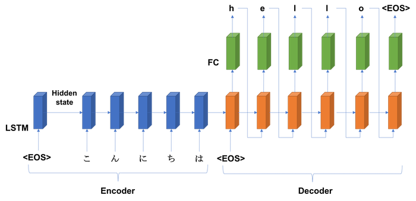
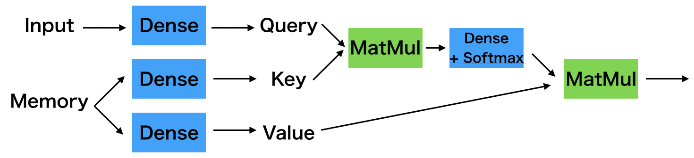
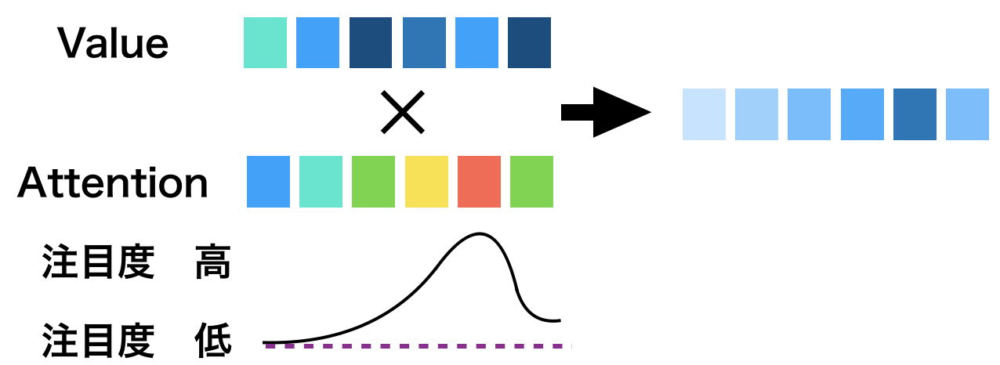
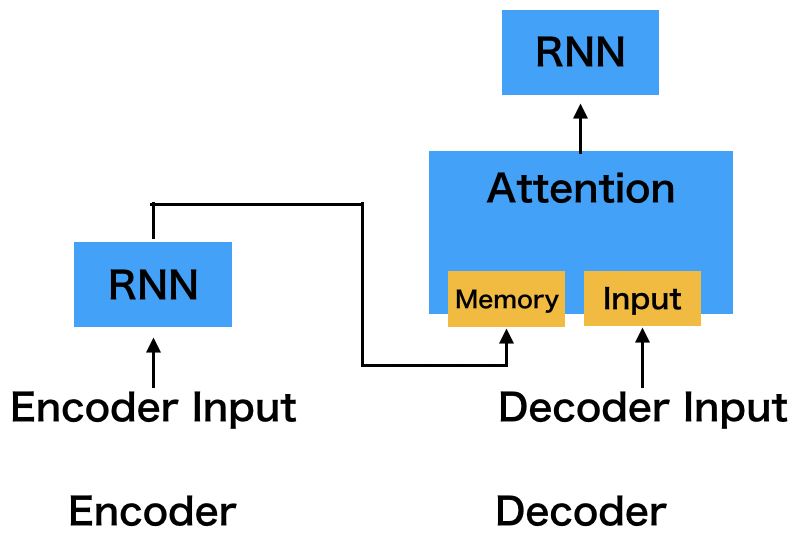
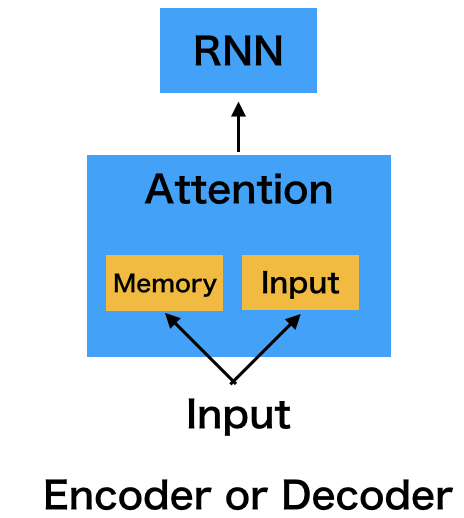
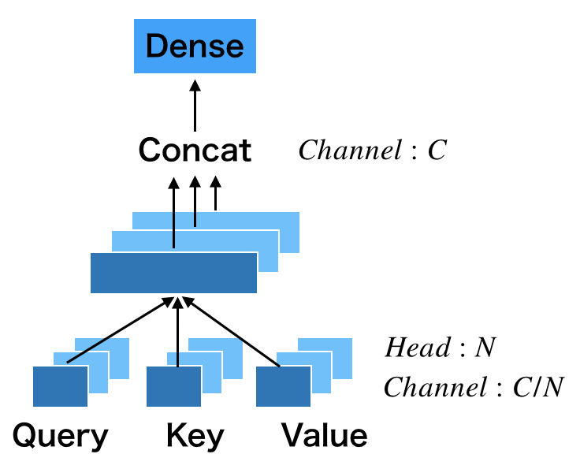
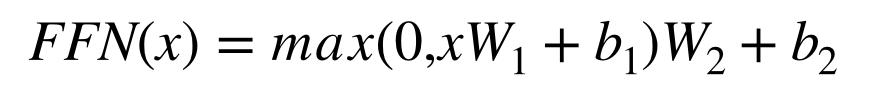
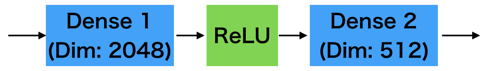
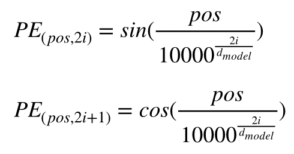
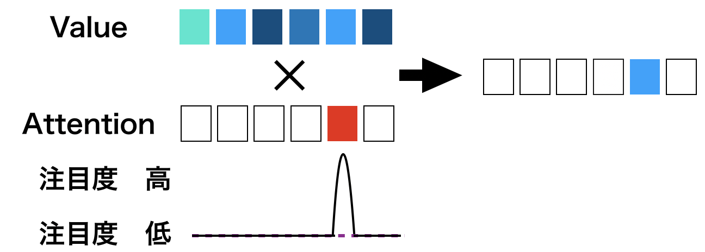

# Q. 言語処理編

ここでは自然言語処理の手法を自分の手で実装していきます。**とりあえずPyTorch, Tensorflow, Keras, Chainer全部で実装してください。**
ネットワークを作ったら、学習率やイテレーションを変えて、テストデータセット *../Dataset/test/images* でテストしてみてください。
ぼくじしん画像処理の研究が専門だったので、ところどころ間違いがあるかもしれません。あったらプルリクください。

## Q. 1hotベクトル化

まずは1hot表現について。1hot表現とは対応するクラスの位置のみが1で、ほかが0である表現ほうほう。例えば、「あいうえお」において「い」を表現するには[0,1,0,0,0]となる。

sandwitchman.txtは僕がだいすきなとある芸人のコントをひらがなにおこしたものである。
これを1hotにする。

必要ならば、これを用いて下さい。

```bash
chars = "あいうおえかきくけこさしすせそたちつてとなにぬねのはひふへほまみむめもやゆよらりるれろわをんがぎぐげござじずぜぞだぢづでどばびぶべぼぱぴぷぺぽぁぃぅぇぉゃゅょっー１２３４５６７８９０！？、。"
chars = [c for c in chars]
```

答え
- [answers/onehot.py](answers/onehot.py)

## Q. RNN (Many-to-one) Step.1. 学習 

1hotベクトルにしたら、それを基にRNNを学習させ、**many-to-one** によりn-gramを実現してみましょう。

RNNにおいては、入力と出力でいくつかパターンがあります。ここではmany-to-oneを実現することで、直前のn文字から次の1文字を予測するRNNを作成し、自動的に文章を生成するRNNを実現します。

ただし、sandwitchman.txtをデータセット化する上で、文章を全部つなげて１つの文字列としましょう。その際に改行を#、最後に@、最初にn(n-gramのn)の数だけ@をつけましょう。ボキャブラリはこれを使っても良いです。改行をわざわざ#にしているのはテキストがコントなので、ボケとツッコミを分けるためです。

```bash
_chars = "あいうおえかきくけこさしすせそたちつてとなにぬねのはひふへほまみむめもやゆよらりるれろわをんがぎぐげござじずぜぞだぢづでどばびぶべぼぱぴぷぺぽぁぃぅぇぉゃゅょっー１２３４５６７８９０！？、。@#"
chars = [c for c in _chars]
```
10gram(n=10)として、モデルは
1. Input=(minibatch, n, class)
2. RNN(128) (chainerは64、128だと計算が遅くなるので)
3. Dense(class) + Softmax
とします。最適化は何でもいいけど、Adamがいいと思います。

| FW | function | | FW | function |
|:---:|:---:|:---:|:---:|:---:|
| pytorch | torch.nn.RNN | | Keras | keras.layers.SimpleRNN |
| TensorFlow | tf.keras.layers.SimpleRNN | | Chainer | ? |

答え
- Pytorch [answers/rnn_pytorch.py](answers/rnn_pytorch.py)
- Tensorflow [answers/rnn_tensorflow_slim.py](answers/rnn_tensorflow_slim.py)
- Keras [answers/rnn_keras.py](answers/rnn_keras.py)

## Q. RNN (Many-to-one) Step.2. テスト

上で学習させたRNNから実際にコントを実現させましょう。

RNNへの最初の入力はin_text='@@@@@@@@@@'です。学習時にテキストの最初に@をつけたのはこのためです。出力はsoftmaxによる確率分布になっているので、np.random.choice()などを使って、確率分布からランダムに1つのインデックスを選びましょう。その選ばれたインデックスが予測された１文字です。
そしたらin_textの後ろに付けましょう。次のRNNへの入力はin_textの後ろから10文字です。以上をまとめると次のアルゴリズムになります。

1. in_text='@@@@@@@@@'をRNNへ入力
2. RNNの出力の確率分布からランダムに1個選ぶ
3. in_textの後ろに付け足す
4. in_text[-10:]をRNNへ入力し、2-4を繰り返す
5. @が出力される、もしくは予測の回数が1000回以上になったら終了する

解答例の一部
```bash
ろのつはんなだよ。なんなじしねねなんだじゃねーの！なかです。いってょっただろ。あったばななしかい。
おれいかなしゃうっきゃた。なんぇいく。ふりー。じゃねーだぞ。
おれしいーろしですしぇたしおれがいの、おかいなーみうしはい。！ほたてつくちかでとかんだろ。１かったおつらのつかるかっただじゃねーか。なんのは。。
はいはしかかんだろ！よ。
ではしか２たんかいのはんだなるのおはと１とれしは２おのたこれしうな。
つおでつっるわるりまだよ、ついんでうかな。あるるしかねたで。
おい、なうってたたなんのつうししかたいくのほう、おれごいりぇいりかたりつ？
１いらねーかー、！１ばいまったおだよ。ななんでこか？
```

答え
- Pytorch [answers/rnn_pytorch.py](answers/rnn_pytorch.py)
- Tensorflow [answers/rnn_tensorflow_slim.py](answers/rnn_tensorflow_slim.py)
- Keras [answers/rnn_keras.py](answers/rnn_keras.py)

## Q. LSTM (Many-to-one)

RNNをLSTMに変えてみましょう。

| FW | function | | FW | function |
|:---:|:---:|:---:|:---:|:---:|
| pytorch | torch.nn.LSTM | | Keras | keras.layers.LSTM |
| TensorFlow | tf.keras.layers.LSTM | | Chainer | chainer.links.LSTM |

解答例の一部
```bash
３０えんのおかえしです。
６００えんじゃねーかよ、じゃあ。なんで３０えんおおくとるんだよ。
あと、これ５００えんいじょうのおかいあげのかたにさしあげてるんですけど。
あ。なんかもらえるの？
れしーとです。
れしーとじゃねーか。ぜんいんにわたせ、これよ。
おはしは２ぜんでよろしかったですか？っていったじゃん。
はい。
おれ、そのいいかただいっきらいなんだよ。
いじ。こちくちってるかったゃ、よかきいす。
```

答え
- Pytorch [answers/lstm_pytorch.py](answers/lstm_pytorch.py)
- Tensorflow [answers/lstm_tensorflow_slim.py](answers/lstm_tensorflow_slim.py)
- Keras [answers/lstm_keras.py](answers/lstm_keras.py)
- Chainer [answers/lstm_chainer.py](answers/lstm_chainer.py)

## Q. Bi-directional LSTM (Many-to-one)

LSTMをBi-directionalにしましょう。

| FW | function | | FW | function |
|:---:|:---:|:---:|:---:|:---:|
| pytorch | torch.nn.LSTM(bidirectional=True) | | Keras | keras.layers.Bidirectional |
| TensorFlow | tf.keras.layers.Bidirectional | | Chainer | chainer.links.LSTM |

解答例の一部
```bash
３０えんのおかえしです。
６００えんじゃねーかよ、じゃあ。なんで３０えんおおくとるんだよ。
あと、これ５００えんいじょうのおかいあげのかたににちゃあたんだいれいれてにいいのでい。
なにゅうなんで。かんなんのわかんだなにどめにがりーせろんがはしたでしきかんぜんおめしあたたよ。

いいき。
びっぐばーがーせっとがおひとつ。おのみものばななしぇいくでよろしかったですか？
```

答え
- Pytorch [answers/lstm_pytorch.py](answers/lstm_pytorch.py)
- Tensorflow [answers/lstm_tensorflow_slim.py](answers/lstm_tensorflow_slim.py)
- Keras [answers/bdlstm_keras.py](answers/lstm_keras.py)
- Chainer [answers/bdlstm_chainer.py](answers/bdlstm_chainer.py)

## Q. GRU (Many-to-one)

GRU (Gated Recurrent Unit) にしましょう。

| FW | function | | FW | function |
|:---:|:---:|:---:|:---:|:---:|
| pytorch | torch.nn.GRU | | Keras | keras.layers.GRU |
| TensorFlow | tf.keras.layers.GRU | | Chainer | chainer.links.GRU |

```bash
３０えんのおかえしです。
６００えんじゃねーかよ、じゃあ。なんで３０えんおおくとるんだよ。
あと、これ５００えんいじょうのおかいあげのかたにさしあげてるんですけど。
あ。なんかもらえるの？
れしーとです。
れしーとじゃねーか。ぜんいんにわたせ、これよ。
おはしは２ぜんでよろしかったですか？
```

答え
- Pytorch [answers/gru_pytorch.py](answers/gru_pytorch.py)
- Tensorflow [answers/gru_tensorflow_slim.py](answers/gru_tensorflow_slim.py)
- Keras [answers/gru_keras.py](answers/gru_keras.py)
- Chainer [answers/gru_chainer.py](answers/gru_chainer.py)

## Q. Seq2seq (Many-to-many)

元論文
- Sequence to Sequence Learning with Neural Networks https://arxiv.org/abs/1409.3215?context=cs (2014)

ここではSeq2seqを実装します。Seq2seqとはSequence to sequenceのことであり、時系列(Sequence)データを入力して、時系列データを得ることです。

<EOS>とはEnd of statement、つまり、文の区切りを指します。
入力の時系列データを一つずつLSTMなりに入力して、その内部の状態（隠れ層のパラメータを保持します。）これを入力の時系列全てに行います。そのご、後ろにFullyConnected層とSoftmaxをつなげて、<EOS>を入力します。すると、最初の時系列データhが出ます。そのhをLSTMへの次の入力として、次の出力eを得ます。これを<EOS>が出るまで繰り返します。

これで何をしてるかというと、「こんにちは」と入力して、「hello」と出力してます。つまり、翻訳などができます。



ここでは、sandwitchman.txtで1行目を入れたら2行目を出力、2行目を入れたら3行目を出力するという様なボケ→ツッコミ、ツッコミ→ボケというような構造を作成してみましょう。

次のexampleが参考になります。

| FW | function | | FW | function |
|:---:|:---:|:---:|:---:|:---:|
| pytorch | https://pytorch.org/tutorials/intermediate/seq2seq_translation_tutorial.html | | Keras | https://github.com/keras-team/keras/blob/master/examples/lstm_seq2seq.py |
| TensorFlow |  | | Chainer |  |

```bash
[In]Speaker.A: >> ちょっとなにいってるかわからない
[Out]Speaker.B: >> ぎっしょにおか、おいまどらせんなーな、いって。おんっつったんだよ。よまとうもたの。
```

答え
- PyTorch [answers/seq2seq_pytorch.py](answers/seq2seq_pytorch.py)
- Keras [answers/gru_keras.py](answers/seq2seq_keras.py)

## Q. Seq2Seq + Attention (Step1. Source Target Attention)

元論文
- Attention if All You Need https://arxiv.org/abs/1706.03762 (2017)

AttentionはNeural Networkにおいて特徴の注目を行うアルゴリズムである。
Attentionには主に Source Target Attention と Self Attention がある。

Source Target Attention は Source(Encoder) から Target(Decoder) への Attention を作成するアルゴリズムである。

Attentionには２つの入力(InputとMemory)が必要となる。
それぞれDense Layerを通すことで、Query, Key, Valueを作成する。
QueryとKeyの要素毎の積(MatMul)をとり、Dense, Softmaxを適用することで、Attentionのマスクを作成する。
AttentionマスクとValueの要素毎の積を取ることで、注目すべき特徴を抜き出す。





つまり、QueryとKeyにより注目領域の作成を行い、Valueから注目特徴を抜き出すという流れになる。
一度、Denseを通すのは特徴量の次元数を調整するためだと思われる。

ちなみにQとKのドット積(MatMul)QKの後に、Keyの次元数d_kの平方根で除算を行っている。d_kが小さい時は問題にならないが、d_kが大きい時はQKの値が大きくなってしまい、Softmaxを適用した時に勾配が急激に小さくなってしまう。そこでsqrt(q_k)で除算を行うことで、スケール調整をしている。


Source Target Attentionでは、InputはTarget(Decoder)内部の入力(シンプルにFeed Forwardして得られる特徴)、MemoryはSourceからの出力された特徴となる。



答え
- PyTorch [answers/seq2seq_attention_sourceTargetAttention_pytorch.py](answers/seq2seq_attention_sourceTargetAttention_pytorch.py)

## Q. Seq2Seq + Attention (Step2. Self Attention)

元論文
- Attention if All You Need https://arxiv.org/abs/1706.03762 (2017)

Self Attention は自身から自身への Attention を作成するアルゴリズムであり、Encoder, Decoderの両方に使うことができる。

Self Attentionでは入力ベクトルをInputとMemoryにすることで、自己に対するAttentionマスクを作成する。



論文によれば Self Attention の次に Source Target Attention を繋げるらしい。

答え
- PyTorch [answers/seq2seq_attention_selfAttention_pytorch.py](answers/seq2seq_attention_selfAttention_pytorch.py)

## Q. Seq2Seq + Attention (Step3. Multi head Attention)

元論文
- Attention if All You Need https://arxiv.org/abs/1706.03762 (2017)

Multi head AttentionではAttentionにおいて、チャネルを分割することで精度向上を図るアルゴリズムである。

普通のAttentionはチャネル数Nに対して１つのQKVで計算を行うが、Multi head Attentionでは以下の方法で計算を行う。
1. QKVのチャネル数をヘッド数だけ分割してQKVを計算する
2. チャネル方向へのConcatを行う
3. DenseLayerに入力して、Attentionの出力とする。



ここでの実装では、チャネル分割を行ってから特徴のshapeを [1, C / N]から [N, C]に変更することでMulti headを実現した。

答え
- PyTorch [answers/seq2seq_attention_multiHeadAttention_pytorch.py](answers/seq2seq_attention_multiHeadAttention_pytorch.py)

## Q. Seq2Seq + Attention (Step4. Feed Forward Network)

元論文
- Attention if All You Need https://arxiv.org/abs/1706.03762 (2017)

EncoderにもDecoderにもFeed Forward Networkが使われている。
Feed Forward NetworkはAttentionの直後に毎回使われ。



論文ではこの数式で表されているが、要はDense Layerを2つ繋げたシンプルな構造だ。
１個目のDense Layerで2048次元にした後、2個目のDense Layerで512次元に削減されている。



答え
- PyTorch [answers/seq2seq_attention_FFN_pytorch.py](answers/seq2seq_attention_FFN_pytorch.py)


## Q. Seq2Seq + Attention (Step5. Positional Encoding)

元論文
- Attention if All You Need https://arxiv.org/abs/1706.03762 (2017)

Sequenceデータに時間的な位置の情報を加えるために、Positional Encodingというものが使われる。
これは次式で計算される。

posが時間的な位置、iが次元での位置、d_modelが特徴量の全次元数になる。



AttentionでSinusoid(Sin)関数をを使っているのは、学習時にSequenceの長さをモデルに学習させることが可能であるためだという。

答え
- PyTorch [answers/seq2seq_attention_positionalEncoding_pytorch.py](answers/seq2seq_attention_positionalEncoding_pytorch.py)


## Q. Seq2Seq + Attention (Final. Parameter setting)

元論文
- Attention if All You Need https://arxiv.org/abs/1706.03762 (2017)

Attentionのパラメータを論文の通りに実装してみる。
Table.3に様々なタイプのパラメータが載っているが、ここではbaseモデルの通りに実装してみる。

- Attentionの回数は N = 6
- Attentionへの入力の次元数は d_model = 512
- Feed Forward Networkの１段目のDense Layerの次元数は d_ff = 2048
- Multi Head AttentionのHead数は h = 8
- AttentionのKeyの次元数は d_k = 64
- AttentionのValueの次元数は d_v = 64
- DropoutのDrop確率は P_drop = 0.1

## Q. Seq2Seq + Attention (Hard Attention)

元論文 >>
- Memory Network https://arxiv.org/abs/1410.3916 (2014)
- Recurrent Models of Visual Attention https://arxiv.org/abs/1406.6247 (2014)

普通のAttentionはSoftmaxによる確率分布でそのままMaskingする。これは**Soft Attention**と呼ばれる。


しかし、Softmaxによる確率分布で値が最大の箇所だけ1それ以外を0の1hotにしたAttentionを**Hard Attention**と呼ぶ。



答え
- PyTorch [answers/seq2seq_attention_hardAttention_pytorch.py](answers/seq2seq_attention_hardAttention_pytorch.py)

## Q. Word2Vec (Skip-gram)

答え
- PyTorch [answers/word2vec_pytorch.py](answers/word2vec_pytorch.py)
