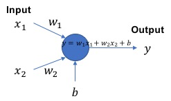
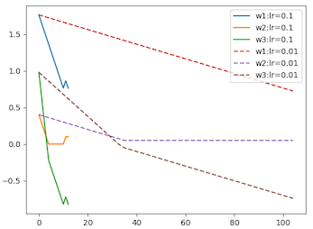
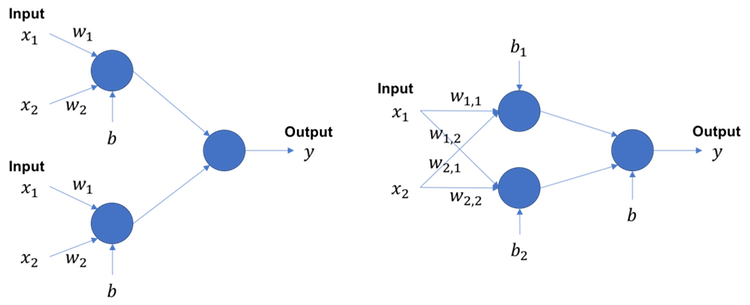

# 理論編

ここではディープラーニングの理論をnumpyを使って自分の手で実装していきます。わからないと無限に泥沼にはまってしまいやすいので、ちょっと答えを見たりしてコーディングしてみましょう。

## Q. パーセプトロン AND
パーセプトロンは人の脳にある神経細胞、ニューロンを数式モデリングしたものです。その仕組は入力値それぞれに重みというパラメータを乗算し、それを加算して出力するシンプルなものです。



ｂは**バイアス**と呼ばれ、ただ、数値を加算するだけの仕組みです。

なので、入力が[x1, x2], 重みが[w1, w2], y = w1 x1 + w2 x2 + b という式ですが、bを w3 x 1 という風に見てやると、入力1に重みw3をかけたものと見なせます。
よって、入力が[x1, x2, 1] , 重みが[w1, w2, w3],  y = w1 x1 + w2 x2 + w3 x3 という風に変換することができます。

ここではパーセプトロンで下記のクラス分類を解きます。これはANDゲートです。まずはこれを実装しましょう。

| 入力 | 出力（クラス）|
|:---:|:---:|
| [0, 0] | -1 |
| [0, 1] | -1 |
| [1, 0] | -1 |
| [1, 1] | 1 |

これはこんな風に書きます。

```python
xs = np.array([[0,0], [0,1], [1,0], [1,1]], dtype=np.float32)
ts = np.array([[-1], [-1], [-1], [1]], dtype=np.float32)
```
重みはこれを用いて下さい。

```python
import numpy as np
np.random.seed(0)
w = np.random.normal(0., 1, (3))
```

次に、入力にバイアス用の[1]を追加して、それぞれ y の値を計算してみましょう。

こういう結果になると思います。

```bash
weight >> [1.76405235 0.40015721 0.97873798]
in >> [0. 0. 1.] y >> 0.9787379841057392
in >> [0. 1. 1.] y >> 1.3788951924729624
in >> [1. 0. 1.] y >> 2.742790330073403
in >> [1. 1. 1.] y >> 3.1429475384406267
```

答え >> [answers/perceptron_1.py]( https://github.com/yoyoyo-yo/DeepLearningMugenKnock/blob/master/Question_theory/answers/perceptron_1.py )

## Q. パーセプトロン 学習

出力が得られたら、次に学習を行っていきます。
そもそも学習というのは**パラメータの自動更新**をいいます。ここでいうパラメータとは重みのことです（バイアスもめんどいので重みとして扱います）。

重みをどうやって更新するかというと、出力を見るわけです。今回の問題は最後の出力が-1か1なので２クラス分類という問題に回帰されます。ですが、先程の出力を見ると、0.9787とかになってます。こういうときは、出力が0以上を1、0未満を-1という風に考えて、問題にフィットさせます。（こういう操作は**活性化関数**と呼ばれるもので操作されていきますが、これは後々）

パーセプトロンでは、出力が逆だった場合、En = ラベル x 入力値　 を重みの更新料とします。（Enは**誤差関数**と呼ばれます。）
つまり、重み w に対して、w = w + lr En を計算します。 lrは**学習率**といい、更新の度合いを表します。0.1や0.01など[0,1]の範囲を取ります。

これを全てのデータに対して更新がなくなるまで、延々と繰り返します。これが学習です。ディープラーニングはこの学習をめちゃくちゃやってすごい成果を出しています。

学習のアルゴリズムは、
1. ４つの入力xに対する出力yを計算
2. yが逆のクラスを指していたら、 En = 正しいラベル x 入力値　を計算
3. w = w + lr En を計算する
4. 2と3を全てのデータで更新がされなくなるまで、４つのデータで繰り返す。
ここではlr=0.1として、これを学習を行ってみましょう。

最終的にこんな風になると思います。iterationというのは４つのデータで一回学習させた、という意味です。つまり、13周して出力が望み通りになったということです。iterationの右の4つの数値はyの出力です。

重みが学習前後で更新されているのが分かるが、なにが起こったかというと、 w1 x1 + w2 x2 + w3 1 において、入力[1, 1]のみが出力1 (つまり0以上)となる重みになりました。weightの3番目の数値がマイナスになっているが、つまり入力[1,1]に対してw1 + w2 + x3がギリギリ0以上になる重みになったことになります。これを**最適化**といいます。

```bash
weight >> [1.76405235 0.40015721 0.97873798]
iteration: 1 y >> [0.97873798 1.37889519 2.74279033 3.14294754]
iteration: 2 y >> [0.67873798 0.97889519 2.34279033 2.64294754]
iteration: 3 y >> [0.37873798 0.57889519 1.94279033 2.14294754]
iteration: 4 y >> [0.07873798 0.17889519 1.54279033 1.64294754]
iteration: 5 y >> [-0.22126202 -0.22110481  1.14279033  1.14294754]
iteration: 6 y >> [-0.32126202 -0.32110481  0.94279033  0.94294754]
iteration: 7 y >> [-0.42126202 -0.42110481  0.74279033  0.74294754]
iteration: 8 y >> [-0.52126202 -0.52110481  0.54279033  0.54294754]
iteration: 9 y >> [-0.62126202 -0.62110481  0.34279033  0.34294754]
iteration: 10 y >> [-0.72126202 -0.72110481  0.14279033  0.14294754]
iteration: 11 y >> [-0.82126202 -0.82110481 -0.05720967 -0.05705246]
iteration: 12 y >> [-0.72126202 -0.62110481  0.14279033  0.24294754]
iteration: 13 y >> [-0.82126202 -0.72110481 -0.05720967  0.04294754]
training finished!
weight >> [ 0.76405235  0.10015721 -0.82126202]
in >> [0. 0.] , out >> -0.8212620158942608
in >> [0. 1.] , out >> -0.7211048075270377
in >> [1. 0.] , out >> -0.05720966992659737
in >> [1. 1.] , out >> 0.04294753844062582
```

答え >> [answers/perceptron_2.py]( https://github.com/yoyoyo-yo/DeepLearningMugenKnock/blob/master/Question_theory/answers/perceptron_2.py )

## Q. パーセプトロン 収束性

lr=0.1と0.01で収束までの、w1, w2, w3の値をそれぞれ線グラフでプロットしてください。



これを見ると、lr=0.1の方が早く学習を終わっていることが分かる。いわゆる学習が終了したことは、最適化によって最適解に到達したことを意味する。lr=0.01ではゆっくりではあるが、最適解に向かっていることが分かる。lr=0.1では学習が終了する直前に値が増えている。解は"谷"の底であり、学習とは谷の底に向かっていくが、学習率が大きいと底に向かう速度が早いため通り越してしまうこともある。これが原因で値が一瞬上昇した。（ただし谷に向かうのは値が減少する方向とは限らない。今回は重みの初期値の関係でたまたま減少の方向だった）


答え >> [answers/perceptron_3.py]( https://github.com/yoyoyo-yo/DeepLearningMugenKnock/blob/master/Question_theory/answers/perceptron_3.py )

## Q. パーセプトロン Sigmoid

ここではパーセプトロンの出力をSigmoidにしてANDゲートを作成します。

**Sigmoid関数**は sigmoid(x) = 1 / (1 + exp(-x)) で出される関数であり、**[0,1] の範囲に正規化する**ことができます。この関数は最後に**確率**を表したい時などに使います。

出力にSigmoidを仕様した時、誤差関数の微分は En = - (t - y) * y * (1 - y) になります。(これは誤差関数をMSEに設定した場合としてます。詳しくは後々)

出力例

```bash
weight >> [1.76405235 0.40015721 0.97873798]
training finished!
weight >> [ 4.65178795  4.65178595 -7.07501703]
in >> [0. 0.] , out >> 0.0008452630740809337
in >> [0. 1.] , out >> 0.08141827807657631
in >> [1. 0.] , out >> 0.0814184274721598
in >> [1. 1.] , out >> 0.9027847768204669
```

答え >> [answers/perceptron_sigmoid.py]( https://github.com/yoyoyo-yo/DeepLearningMugenKnock/blob/master/Question_theory/answers/perceptron_sigmoid.py )

## Q. パーセプトロン bias

これでANDゲートが作成できましたが、今は入力の後ろにわざわざ1を付け足して、バイアスを表記しています。これは非常にめんどくさいです。なので、ここではバイアスをwとは違うパラメータとして変数定義するように書き直してみましょう。

つまり、 np.dot(z1, w) + b という表記になります。この時、バイアスの勾配計算では Enと[1,1,...,1]の内積をとって計算します。
それは grad_b = np.dot(np.ones([En.shape[0]]), En) と書けば表すことができます。

出力例。これを見ると、さっきと全く同じ結果になっています。つまり、バイアスを別変数化することに成功している証拠です。

```bash
weight >> [1.76405235 0.40015721]
bias >> [0.97873798]
training finished!
weight >> [4.65178795 4.65178595]
bias >> [-7.07501703]
in >> [0. 0.] , out >> 0.0008452630740809337
in >> [0. 1.] , out >> 0.08141827807657631
in >> [1. 0.] , out >> 0.0814184274721598
in >> [1. 1.] , out >> 0.9027847768204669
```

答え >> [answers/perceptron_sigmoid_bias.py]( https://github.com/yoyoyo-yo/DeepLearningMugenKnock/blob/master/Question_theory/answers/perceptron_sigmoid_bias.py )

## Q.パーセプトロン OR

ANDゲートができたので、次はORゲートをやってみましょう。ORゲートは２入力値の少なくともどっちかが1なら出力が1になるゲートです。

```bash
xs = np.array([[0,0], [0,1], [1,0], [1,1]], dtype=np.float32)
ts = np.array([[0], [1], [1], [1]], dtype=np.float32)
```

出力例

```bash
weight >> [1.76405235 0.40015721]
bias >> [0.97873798]
training finished!
weight >> [5.38562211 5.3839535 ]
bias >> [-2.43750783]
in >> [0. 0.] , out >> 0.08035689026769402
in >> [0. 1.] , out >> 0.9500952318233824
in >> [1. 0.] , out >> 0.9501742881694675
in >> [1. 1.] , out >> 0.9997593840396385
```

答え >> [answers/perceptron_or.py]( https://github.com/yoyoyo-yo/DeepLearningMugenKnock/blob/master/Question_theory/answers/perceptron_or.py )

## Q. パーセプトロン NOT

ここまできたらNOTゲートも作りましょう。NOTは0と1を反転させるものです。

```bash
xs = np.array([[0], [1]], dtype=np.float32)
ts = np.array([[1], [0], dtype=np.float32)
```

出力例

```bash
weight >> [1.76405235]
bias >> [0.40015721]
training finished!
weight >> [-5.64330534]
bias >> [2.70996353]
in >> [0.] , out >> 0.9376120153439501
in >> [1.] , out >> 0.050529755525618475
```

答え >> [answers/perceptron_not.py]( https://github.com/yoyoyo-yo/DeepLearningMugenKnock/blob/master/Question_theory/answers/perceptron_not.py )

## Q. パーセプトロン XORゲート

次にXORを作成しましょう。XORは2入力値のうち、どっちかのみが1なら出力１、それ以外は出力０となる関数です。

```bash
xs = np.array([[0,0], [0,1], [1,0], [1,1]], dtype=np.float32)
ts = np.array([[0], [1], [1], [0]], dtype=np.float32)
```

出力例。いくらがんばってもXORはパーセプトロンでは実現できません。XORは１次関数で表せない、**非線形**関数だからです。一個のパーセプトロンではAND, OR, NOTのような線形なものは解くことができることを**パーセプトロンの収束定理**といいます。

```bash
weight >> [1.76405235 0.40015721]
bias >> [0.97873798]
training finished!
weight >> [2.31431790e-09 2.31427894e-09]
bias >> [-2.74508346e-09]
in >> [0. 0.] , out >> 0.4999999993137292
in >> [0. 1.] , out >> 0.4999999998922988
in >> [1. 0.] , out >> 0.4999999998923086
in >> [1. 1.] , out >> 0.5000000004708783
```

答え >> [answers/perceptron_xor.py]( https://github.com/yoyoyo-yo/DeepLearningMugenKnock/blob/master/Question_theory/answers/perceptron_xor.py )

## Q. 多層パーセプトロン FeedForward

XORを解くためにパーセプトロンを2段にしましょう。

2段は左図のイメージですがこれだと見にくいので、右図のイメージで作りましょう。
まずはFeedForward(順伝搬)を作成しましょう。全部のパーセプトロンの出力にsigmoidを適用します。



```bash
weight1 >>
[[1.76405235 0.40015721]
[0.97873798 2.2408932 ]]
bias1 >>
[ 1.86755799 -0.97727788]
weight_out >>\m [[ 0.95008842]
[-0.15135721]]
bias_out >>
[-0.10321885]
in >> [0. 0.] , out >> [0.66336776]
in >> [0. 1.] , out >> [0.66300847]
in >> [1. 0.] , out >> [0.68307483]
in >> [1. 1.] , out >> [0.67045822]
```

答え >> [answers/multi_perceptron_1.py]( https://github.com/yoyoyo-yo/DeepLearningMugenKnock/blob/master/Question_theory/answers/multi_perceptron_1.py )

## Q. 多層パーセプトロン 学習

順伝搬ができたら学習の仕組みも作りましょう。

まず出力層の逆伝搬は１個のパーセプトロンの時と同じです。
問題は中間層の学習。重みとバイアスの勾配はこんな風に計算します。

```bash
grad_u1 = np.dot(En, wout.T) * z2 * (1 - z2)
grad_w1 = np.dot(z1.T, grad_u1)
grad_b1 = np.dot(np.ones([grad_u1.shape[0]]), grad_u1)
```

出力例。これを見るとしっかりXORになってます。なぜできるようになったかというと、簡単に言えば関数が複雑になったからです。普通の一個パーセプトロンは f(x) = sigmoid(w1 x1 + w2 x2 + b) という単純な１次関数（sigmoidの中が）だったけど、ここで実装した多層パーセプトロンは f(X) = sigmoid( wout1 ( sigmoid(w11 x1 + w12 x2 + b1) ) + wout2 ( sigmoid(w21 x1 + w22 x2 + b2) )  + b) という超複雑な関数になってます。sigmoidが無いと考えれば、二次関数になります。つまり、一個のときよりすごく非線形になった、と見れます。最近(2019.3.13)、ツイッターとかでディープラーニングは最小二乗法っていうのがかなり波紋を呼んだけど、loss関数が最小二乗(Mean Squared Error)なら、割と的を得てるんじゃないかと。

```bash
weight1 >>
[[1.76405235 0.40015721]
[0.97873798 2.2408932 ]]
bias1 >>
[ 1.86755799 -0.97727788]
weight_out >>\m [[ 0.95008842]
[-0.15135721]]
bias_out >>
[-0.10321885]
weight1 >>
[[5.13045752 3.40840853]
[5.22368332 3.42965266]]
bias1 >>
[-2.01148476 -5.21795913]
weight_out >>
[[ 6.45339121]
[-6.76002403]]
bias_out >>
[-2.96478314]
in >> [0. 0.] , out >> [0.09624175]
in >> [0. 1.] , out >> [0.90638069]
in >> [1. 0.] , out >> [0.90588055]
in >> [1. 1.] , out >> [0.10374782]
```

ちなみに2層で実現できる理由は、XORが３つの線形ゲートで等価できるから。
A xor B = (A or B) and not(A and B)
つまり それぞれのゲートをパーセプトロンで置き換えることができるから、2パーセプトロン層と1パーセプトロン層で表現可能になる。

```bash
A --- A or B --------|
   X                 +--- A and
B --- not(A anb B) --|
```

答え >> [answers/multi_perceptron_2.py]( https://github.com/yoyoyo-yo/DeepLearningMugenKnock/blob/master/Question_theory/answers/multi_perceptron_2.py )

## Q. 更に多層パーセプトロン(ディープラーニングへの進化)

今度は中間層を1層さらに増やして、3層構造にしましょう。

答え >> [answers/multi_perceptron_3.py]( https://github.com/yoyoyo-yo/DeepLearningMugenKnock/blob/master/Question_theory/answers/multi_perceptron_3.py )

## Q. ニューラルネットのクラス化

ここから、ちょっと厄介になります。注意してください。

ここまでで、ニューラルネットの原型ができました。だけど今の状態では、重みをいちいち手動で定義したり、順伝搬、逆伝搬も全て手動でやらなきゃなので、とても使いにくいです。実際、DLのライブラリはこんな面倒な定義をしなくてもいいようにできています。

なのでクラス化してもっと楽に定義してみましょう。ここでは、PyTorchっぽく作ってみましょう。


例えば、FullyConnectedLayerをクラス化して、かつlayer同士を繋げるModelというクラスを作って、こんなふうに定義できるようにしてみましょう。

```python
model = Model(FullyConnectedLayer(in_n=2, out_n=64, activation=sigmoid),
              FullyConnectedLayer(in_n=64, out_n=32, activation=sigmoid),
              FullyConnectedLayer(in_n=32, out_n=1, activation=sigmoid), lr=0.1)
```

forward計算は

```python
model.forward(xs)
```

Lossの計算は

```python
model.backward(ts)
```

これならPyTorchっぽくできます。これっぽくするには、こうするといいかもしれません。（この通りにしなくても、自分の作りやすいようにしてください）

```python
class FullyConnectedLayer():
    def __init__(self, in_n, out_n, use_bias=True, activation=None):
        # write your process

    def forward(self, feature_in):
        # write your process
    
    def backward(self, w_pro, grad_pro):
        # write your process
    
class Model():
    def __init__(self, *args, lr=0.1):
        self.layers = args
        for l in self.layers:
            l.set_lr(lr=lr)
    
    def forward(self, x):
        # write your process
    
    def backward(self, t):
        # write your process
```

答え >> [answers/multi_perceptron_class.py]( https://github.com/yoyoyo-yo/DeepLearningMugenKnock/blob/master/Question_theory/answers/multi_perceptron_class.py )


