# Q. 理論編2

## 画像認識

ニューラルネットを用いて画像認識をしてみましょう。ここではホーム下にあるData/Train/Imagesのアカハライモリとマダライモリの2クラス分類をします。データセットの読み込みは「ディープラーニングをやる前の準備編」を参照して下さい。

前に作成したニューラルネットをクラス化したものは、最後が[0,1]で出力されるものでした。なので、アカハライモリなら0、マダライモリなら1になるように学習させましょう。ネットワークの構成や学習率など変えてみましょう。

解答例

```bash
in >> ../Dataset/test/images/madara/madara_0011.jpg , out >> [[0.64227836]]
in >> ../Dataset/test/images/madara/madara_0010.jpg , out >> [[0.95394102]]
in >> ../Dataset/test/images/madara/madara_0009.jpg , out >> [[0.97719531]]
in >> ../Dataset/test/images/akahara/akahara_0009.jpg , out >> [[0.3966193]]
in >> ../Dataset/test/images/akahara/akahara_0011.jpg , out >> [[0.15386073]]
in >> ../Dataset/test/images/akahara/akahara_0010.jpg , out >> [[0.45547317]]
```

答え >> [answers/neuralnet_classification.py]( https://github.com/yoyoyo-yo/DeepLearningMugenKnock/blob/master/Question_theory2/answers/neuralnet_classification.py )


## 誤差関数

上の画像認識ができたら、学習の途中の様子を見るために誤差関数を定義してみましょう。

**誤差関数** とは、ニューラルネットを学習させる時に勾配を決定するためのものでした。これまでは、詳しく言ってませんでしたが、誤差関数を**MSE(Mean Squared Error、平均二乗誤差)** としていました。つまり、

En = 1 / 2 x Sum(y - t)^2

です。tは教師ラベル、yはネットワークの出力です。Enはミニバッチ数で割ったりすることもあります。学習ではEnを出力について微分することで、勾配(gradient)を求めます。MSEの勾配を求めると、

dEn = (y - t) x dt 

となり、ネットワークの出力にsigmoidを用いていると、 dt = t x (1 - t) となることから、

dEn = (y - t) x t x (1 - t)

となります。

50イテレーション毎にlossを見てみましょう。するとこんな感じになります。Lossが小さくなってるなっています。つまり、学習が進んでいます。

```bash
ite: 1 Loss >> 0.21145435854370662
ite: 51 Loss >> 0.017194028985311683
ite: 101 Loss >> 0.01043327245961434
ite: 151 Loss >> 0.006335812451576117
ite: 201 Loss >> 0.011451181062997718
ite: 251 Loss >> 0.004575797174016214
ite: 301 Loss >> 0.009644233244169778
ite: 351 Loss >> 0.009414837693413225
ite: 401 Loss >> 0.0033257868572083194
ite: 451 Loss >> 0.004476944922050385
ite: 501 Loss >> 0.002690575432099319
ite: 551 Loss >> 0.0019436343984067564
ite: 601 Loss >> 0.0018718536177370353
ite: 651 Loss >> 0.0027758770291329074
ite: 701 Loss >> 0.0013937762166776222
ite: 751 Loss >> 0.0025263516368287924
ite: 801 Loss >> 0.0017231197400640326
ite: 851 Loss >> 0.0012856963828671334
ite: 901 Loss >> 0.001245978643753974
ite: 951 Loss >> 0.007154258371970642
```

答え >> [answers/neuralnet_loss.py]( https://github.com/yoyoyo-yo/DeepLearningMugenKnock/blob/master/Question_theory2/answers/neuralnet_loss.py )

## Sigmoid Cross Entropy

ここでは誤差関数を**CrossEntropy** に変えてみましょう。

Sigmoidを用いたCrossEntropyは次式で定義されます。

En = -t ln(y) - (1 - t) ln(1 - y)

これを微分して、ある程度計算すると、

dEn = t - y

となります。（実装時は注意）

```bash
in >> ../Dataset/test/images/madara/madara_0011.jpg , out >> [[0.80955499]]
in >> ../Dataset/test/images/madara/madara_0010.jpg , out >> [[0.92180663]]
in >> ../Dataset/test/images/madara/madara_0009.jpg , out >> [[0.9601341]]
in >> ../Dataset/test/images/akahara/akahara_0009.jpg , out >> [[0.41643517]]
in >> ../Dataset/test/images/akahara/akahara_0011.jpg , out >> [[0.16013807]]
in >> ../Dataset/test/images/akahara/akahara_0010.jpg , out >> [[0.57682873]]
```

答え >> [answers/neuralnet_sce.py]( https://github.com/yoyoyo-yo/DeepLearningMugenKnock/blob/master/Question_theory2/answers/neuralnet_sce.py )

## Convolutional Layer

これまではニューラルネットをやってきました。ニューラルネットはそもそも認識のために提案されたものでした。認識とは一般的には(1)特徴抽出、(2)認識の２つのパートに別れます。

ここでちょっとだけ、ディープラーニングが流行る前までの歴史を見てみます。
(1)特徴抽出では、HOGやSIFTといった手法を用いて、画像から画像特有のたくさんの固定サイズの値をベクトルとしてまとめて、**特徴量**として扱ってました。例えばHOGという方法を用いると、画像の値の変化の大きい方向を特徴量として扱ってます。
(2)認識部では、特徴量を基に判別していました。
1. 人工知能第一次ブームではデータベース形式であり、学習データの特徴量を正解ラベルとペアにして保存していました。ただし、ただでさえハード技術が発達していなかった当時にメモリが不足するのは当たり前でした。（現代でもとても無謀ですが）
2. 人工知能第二次ブームでは機械学習が始まりました。SVM(Support Vector Machine)や決定木(Decision Tree)、Random Forestなど特徴量を基に所属クラスを予測する方法です。少し難しい話をすると、これはN次元の特徴量が存在する空間（**N次元特徴空間**）における**分離超平面(separating hyperplane)** のパラメータを決定する方法です。各特徴量がこの分離超平面によって、それぞれが所属するクラスの部分空間に分けることができれば、クラス判別ができるということです。

N次元空間での分離超平面はN-1次元をとる。

| 2次元空間 | 3次元空間 |
|:---:|:---:|
| 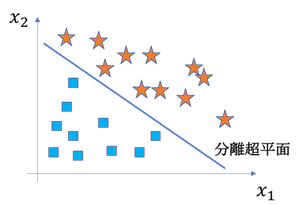 | 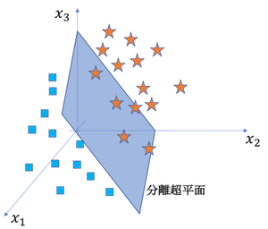 |

現在のディープラーニングは第三次ブームであり、(1)特徴抽出、(2)認識を全て行ってしまいます。
そしてこれまでやってきたニューラルネットワークが(2)認識に当たります（ニューラルネットのみで認識することもありますが、基本的にはconvolutionによる特徴抽出部も使います。）。なので、ここではディープラーニングにおける(1)特徴抽出を行っていきます。

この特徴抽出がConvolutional Layerです。これはただのフィルタリングです。フィルタリングとは下の左の画像のように、フィルタと対応する値を乗算して、その和を求めることです。Convolutional Layerではこのフィルタのことを**Kernel（カーネル）** と呼びます。これをずらしながら計算することで、下の右画像のような演算を行います。これを**畳み込み** といいます。（信号処理の畳み込みとはちょっと違います。）

| フィルタリング | 画像全体への畳込み |
|:---:|:---:|
| 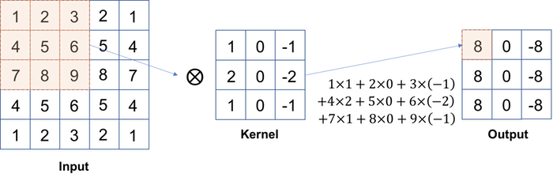 | 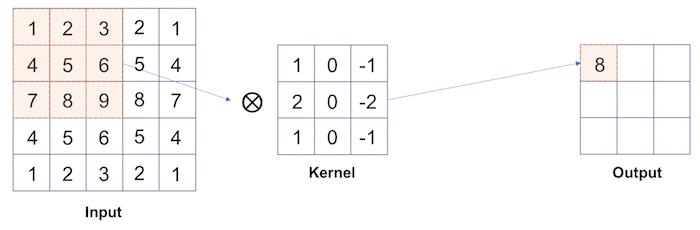 |

少し細かい話もあるのですが、それは後々やるとして、ここでは、akahara_0001.jpg を読み込んで、64 x 64 にリサイズして、畳み込みを行いましょう。

この時、入力は3チャネル(RGB)になります。このようにConvolutional Layerへの入力は複数チャネルになります。なので、実際のconvolution操作はこのようになります。

まず各チャネルにフィルタリングして、その結果の和を出力の1ピクセルにします。つまり、出力のチャネルはカーネル数と同じになります。

| 1カーネル | 4カーネル |
|:---:|:---:|
| 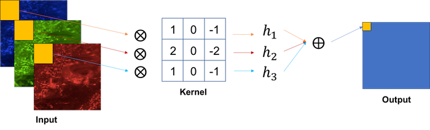 | 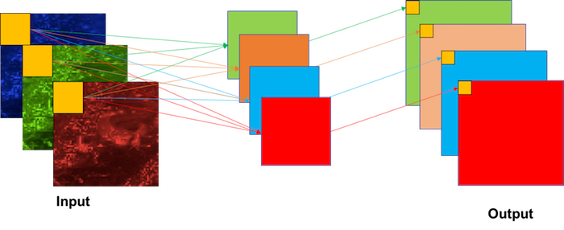 |

ここではニューラルネットのプログラムは一旦忘れて、akahara_0001.jpg を読み込み、3x3のサイズのランダムな値を持つ４つのカーネルで畳み込みしてみましょう。

カーネルは次のように定義してみましょう。順番が[チャネル、縦、横]になっているので、入力画像も[チャネル、縦、横]にしましょう。

```python
import numpy as np
np.random.seed(0)
kernels = np.random.normal(0, 0.01, [4, 3, 3])
```

答え。これを見ると、それぞれ出力が違っています（ランダムなので当たり前ですが）。Deep Learningではこのカーネルが多くあること、convolutionが何層にもあることで様々な状態の出力を取ることができます。この出力が**特徴量** として扱われます。

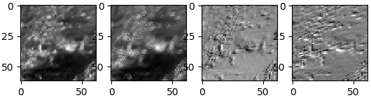

答え >> [answers/conv_kernel.py]( https://github.com/yoyoyo-yo/DeepLearningMugenKnock/blob/master/Question_theory2/answers/conv_kernel.py )

## Padding

**padding(パディング)** とは、入力の周りを何らかの値で埋めることです。先のconvolutionでは出力画像が入力画像より小さくなっています。具体的には floor(kernel_size / 2) * 2だけ小さくなってしまいます。これでは、特徴量も減ってしまうし、サイズも変わってしまうので、デメリットが多いです。

そこで、入力画像をパディングします。具体的には0で周りを埋める**0-padding** がよく使われます。先のconvolutionにも0パディングをして、入力画像と出力画像のサイズを同じにしましょう。

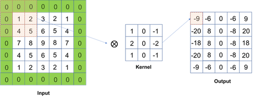

答え >> [answers/conv_pad.py]( https://github.com/yoyoyo-yo/DeepLearningMugenKnock/blob/master/Question_theory2/answers/conv_pad.py )

## Stride

**Stride(ストライド)** とは、カーネルを動かすサイズのことです。stride=2にしてみると、出力サイズがだいたい半分になります。

| stride 1 | stride 2 |
|:---:|:---:|
| 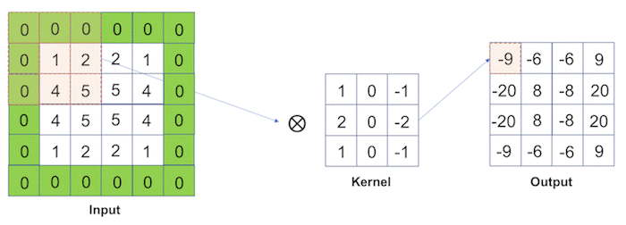 | 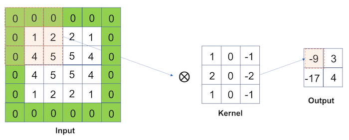 |

答え。これを見ると、画像が少し集約されているように見えます。実際画像サイズが半分になっています。

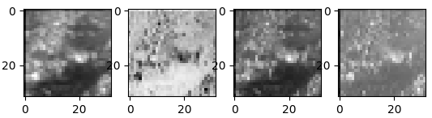

答え >> [answers/conv_stride.py]( https://github.com/yoyoyo-yo/DeepLearningMugenKnock/blob/master/Question_theory2/answers/conv_stride.py )

## Convolutional Layer. クラス化


## Max Pooling Layer

次にPoolingLayerを実装しましょう。PoolingLayerとはPooling、つまりピクセルの集約操作を行います。これは一般的には入力を一定サイズにグリッド分割し、各グリッド内の代表値を出力します。代表値はグリッド領域内の最大値(Max-pooling)、または平均値(Average-pooling)などを用いる。

| Max-pooling | Average-pooling |
|:---:|:---:|
| 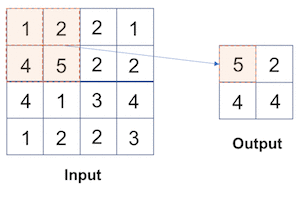 | 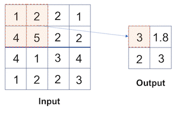 |

ここではakahara_0001.jpgを64x64にリサイズして、2x2でmax-poolingしてみましょう。poolingでは入力サイズと同じチャネル数の出力を出す。今回は入力は3チャネル(BGR)なので、出力もBGRの順になる。

答え

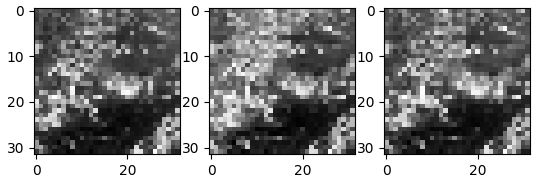

答え >> [answers/maxpool.py]( https://github.com/yoyoyo-yo/DeepLearningMugenKnock/blob/master/Question_theory2/answers/maxpool.py )

## Average Pooling Layer

ここではakahara_0001.jpgを64x64にリサイズして、2x2でaverage-poolingしてみましょう。

答え

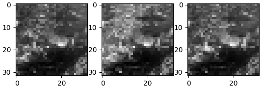

答え >> [answers/avepool.py]( https://github.com/yoyoyo-yo/DeepLearningMugenKnock/blob/master/Question_theory2/answers/avepool.py )
